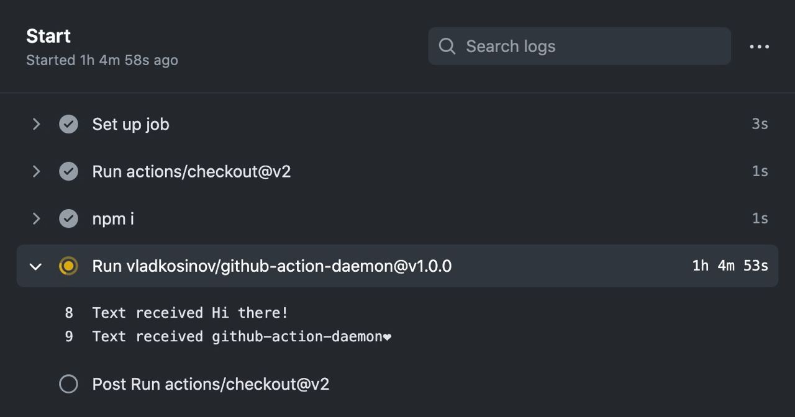

# Example github-action-daemon with telegram-bot

## Disclaimer ⚠️⚠️⚠️

Running a daemon as a server and accessing it from outside the VM is not within the terms of use for Actions. 

This package just a demonstration of an easy way of running applications using GitHub Actions and not intended to be used by anyone.

Please don't do this.


Runs telegram bot using Github Actions.

Write to the bot by yourself: [t.me/github_action_daemon_bot](https://t.me/github_action_daemon_bot)

And check logs here: https://github.com/vladkosinov/github-action-daemon-example-telegram-bot/actions




### Running bot

```yml
name: Running bot
on:
  push:
    branches:
      - main
  schedule:
    # # # # # # # # # #
    # restart each hour
    - cron: "0 */1 * * *"
    # # # # # # # # # # 

jobs:
  start:
    runs-on: ubuntu-latest
    name: Start

    steps:
      - uses: actions/checkout@v2

      - name: npm i
        run: npm i

      - uses: vladkosinov/github-action-daemon@v1.0.0
        env:
          BOT_TOKEN: ${{ secrets.BOT_TOKEN }}
        with:
          command: node ./index.js
```
